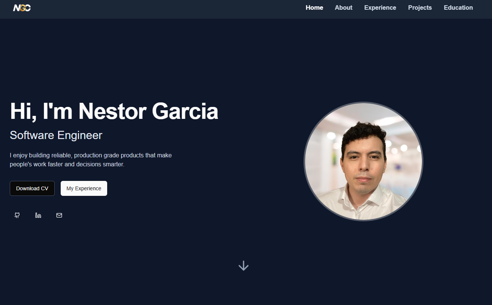
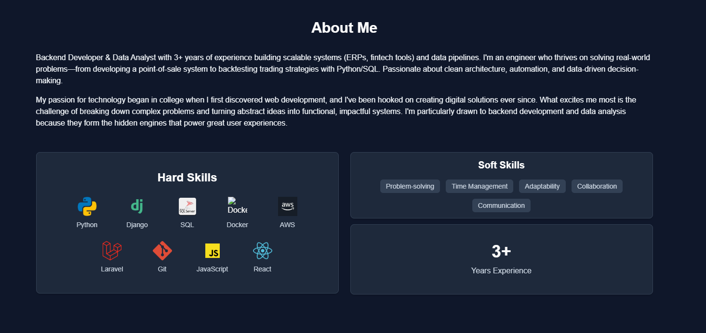
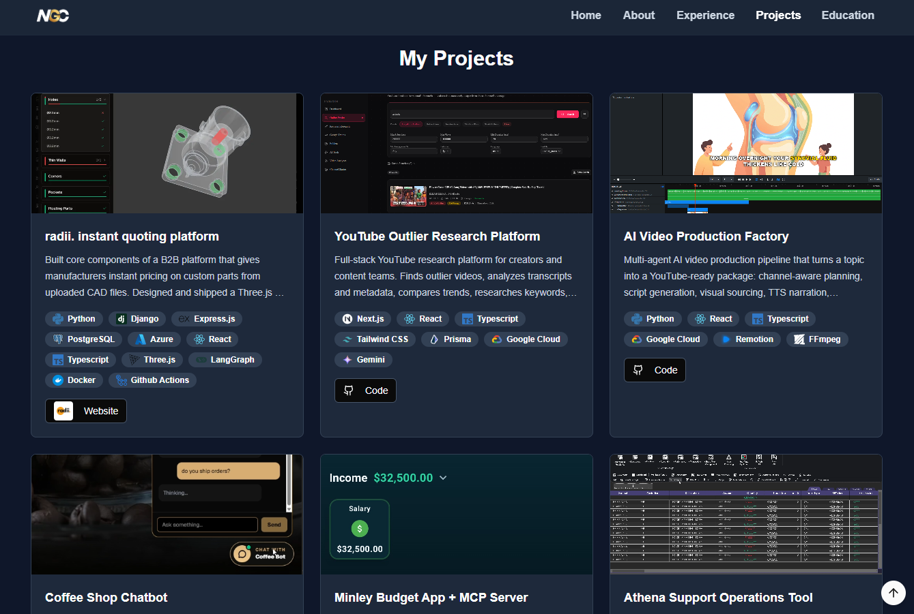

# Nestor Garcia — Portfolio

Welcome to my personal software engineering portfolio, built with **Next.js**, **Tailwind CSS**, and the **App Router**.  
It showcases my projects, experience, skills, and contact information — all in a clean and modern interface.

---

## Live Site

[https://nestorportf.vercel.app/](https://nestorportf.vercel.app/)

---

## Screenshots

### Home Page



### About + Skills



### Projects



---

## Tech Stack

- **Framework:** [Next.js 16](https://nextjs.org/) (App Router)
- **UI Library:** [React 19](https://react.dev/)
- **Styling:** [Tailwind CSS](https://tailwindcss.com/)
- **Icons:** [Lucide Icons](https://lucide.dev/)
- **Deployment:** [Vercel](https://vercel.com/)
- **Language:** TypeScript

---

## Features

- Responsive, dark mode-ready layout
- Sections: About, Skills, Projects, Experience, Education, Contact
- Smooth scroll + active nav highlight
- SEO optimized head configuration
- Modular components for easy scaling

---

## Setup Instructions

```bash
git clone https://github.com/NesDevr/Portfolio.git
cd Portfolio
npm install
npm run dev
```
